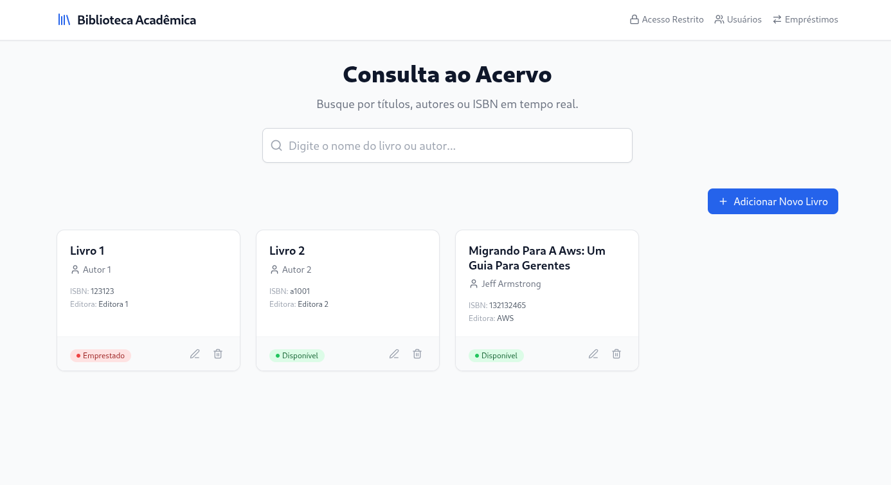
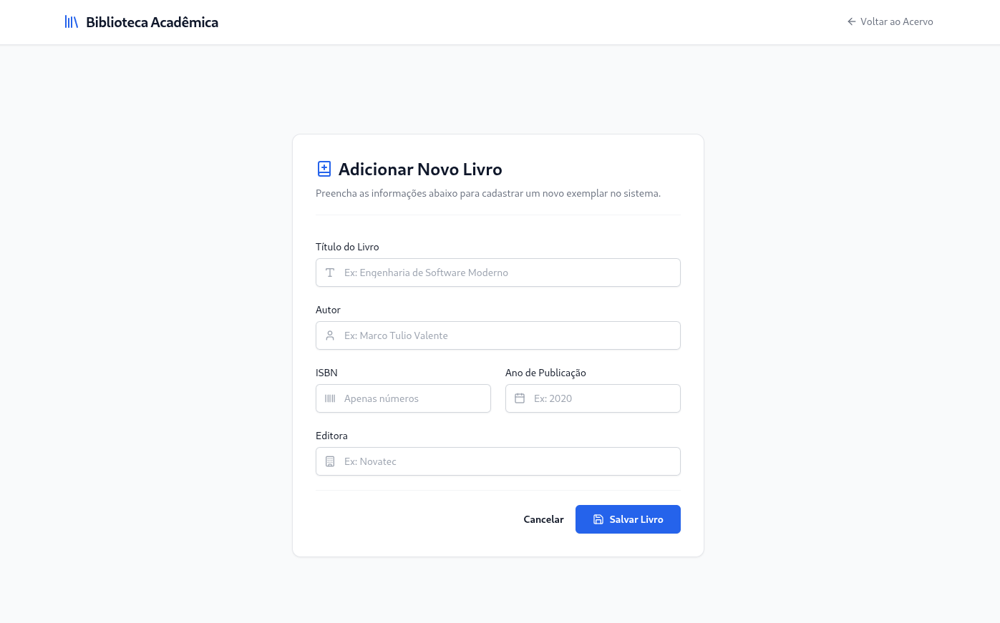
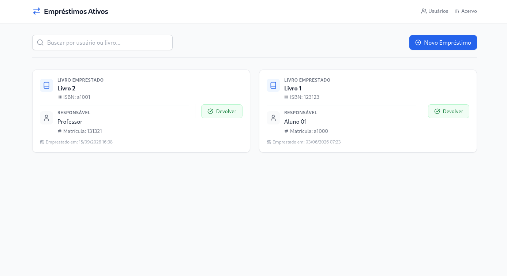
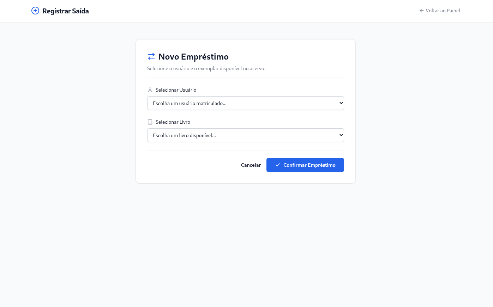
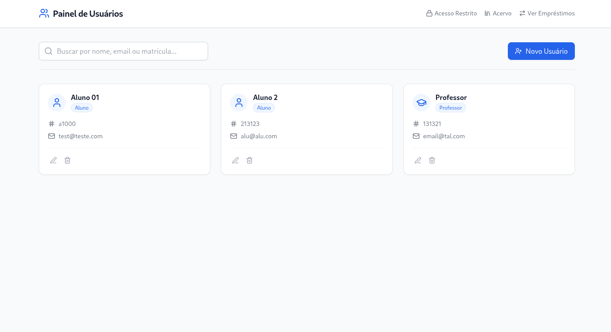
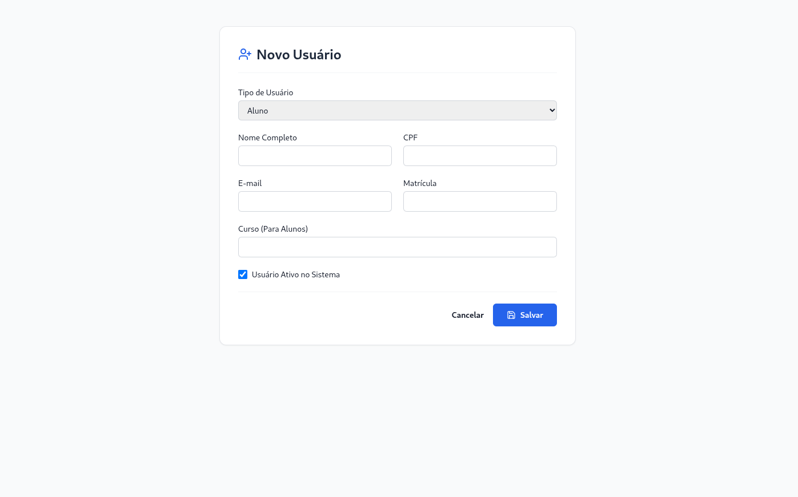

# 📚 Sistema de Gestão de Biblioteca


Uma aplicação web *Full-Stack* robusta para administração e controle de bibliotecas. Desenvolvido com foco em **performance, usabilidade e manutenibilidade**, o projeto utiliza uma arquitetura baseada em renderização no servidor (SSR) potencializada com interatividade moderna.

---

## 🎯 O Projeto

O objetivo deste software é fornecer uma interface fluida e intuitiva para o gerenciamento do dia a dia de uma biblioteca, eliminando processos manuais. A aplicação é dividida em módulos lógicos (Apps Django) para garantir o baixo acoplamento e a alta coesão do código.

### ✨ Funcionalidades Principais

*   📖 **Gestão de Acervo:** Interface completa (CRUD) para adicionar, editar e remover livros do catálogo. Busca e listagem otimizadas.
*   👥 **Gestão de Usuários:** Cadastro e manutenção dos dados dos leitores/usuários da biblioteca.
*   🔄 **Operações de Empréstimo:** Painel dinâmico para registrar novos empréstimos de livros e processar devoluções com controle de status.
*   ⚙️ **Painel Administrativo:** Integração nativa com o poderoso Django Admin para gerenciamento avançado e controle de acesso em nível de sistema.

---

<details>
  <summary>📸 Clique para ver as capturas de tela do sistema</summary>
  <br>

  <p align="center">
    
    <br>
    <em>Legenda: Visão geral do acervo, com opções para pesquisar, editar e excluir.</em>
  </p>
  <br>

  <p align="center">
    
    <br>
    <em>Legenda: Modal dinâmico (carregado via HTMX) para cadastro de novos títulos.</em>
  </p>
  <br>

  <p align="center">
    
    <br>
    <em>Legenda: Gestão centralizada de empréstimos ativos, atrasados e histórico.</em>
  </p>
  <br>

  <p align="center">
    
    <br>
    <em>Legenda: Gestão centralizada de empréstimos ativos, atrasados e histórico.</em>
  </p>
  <br>

  <p align="center">
    
    <br>
    <em>Legenda: Gestão centralizada de usuários cadastradis e ativos no sistema.</em>
  </p>
  <br>

  <p align="center">
    
    <br>
    <em>Legenda: Modal dinâmico (carregado via HTMX) para cadastro de novos usuários.</em>
  </p>
  <br>

</details>

---
## 🛠️ Tecnologias e Arquitetura

Este projeto foi construído utilizando o conceito de **Hypermedia-Driven Application (HDA)**. Em vez de criar uma API REST pesada e um front-end SPA (Single Page Application) complexo, optei por uma abordagem mais pragmática e performática:

*   **Back-end:** [Django](https://www.djangoproject.com/) — O framework web Python "com baterias inclusas". Escolhido pela sua segurança, ORM robusto e velocidade de desenvolvimento.
*   **Front-end Reativo:** [HTMX](https://htmx.org/) — Permite atualizações parciais do DOM diretamente do servidor (via AJAX), garantindo a sensação de uma SPA moderna sem a complexidade de gerenciar estados no client-side com JavaScript.
*   **Estilização:** [Tailwind CSS](https://tailwindcss.com/) — Utilizado para criar uma interface moderna, responsiva e limpa de forma utilitária.
*   **Ícones:** [Lucide Icons](https://lucide.dev/) — Ícones consistentes e leves para melhorar a UX.
*   **Banco de Dados:** SQLite3 — Leve, transacional e perfeitamente adequado para o escopo inicial da aplicação.
*   **Gerenciamento de Pacotes:** `uv` — Utilizado para um gerenciamento de dependências (`pyproject.toml` / `uv.lock`) e ambientes virtuais incrivelmente rápido e moderno.

---

## 📂 Estrutura do Projeto

O código foi organizado seguindo as melhores práticas do Django, isolando domínios de negócio em aplicativos específicos:

```text
gestao_biblioteca/
├── config/           # Configurações globais do projeto (settings, asgi, wsgi)
├── acervo/           # Domínio de negócio: Livros e catálogo (models, views, HTMX partials)
├── usuarios/         # Domínio de negócio: Leitores da biblioteca
├── operacoes/        # Regras de negócio cruzadas: Empréstimos e devoluções
└── templates/        # Arquitetura de UI modular, dividida em páginas, modais e componentes (partials)
```

 Destaque Técnico: Os templates de cada app estão organizados com subpastas modals/ e partials/, demonstrando um design system no lado do servidor preparado para o HTMX carregar apenas os fragmentos HTML necessários.

## 🚀 Como Executar Localmente
### Pré-requisitos
- Python 3.11+ instalado.

- uv instalado para gerenciamento ultrarrápido de pacotes.

### Passo a Passo

Clone o repositório
```
git clone [https://github.com/SEU_USUARIO/gestao-biblioteca.git](https://github.com/SEU_USUARIO/gestao-biblioteca.git)
cd gestao-biblioteca
```

Crie e ative o ambiente virtual usando o uv
```
uv venv
source .venv/bin/activate  # No Windows use: .venv\Scripts\activate
```

Instale as dependências
```
uv pip install -r requirements.txt
# Ou, se estiver usando a build nativa do pyproject: uv sync
```

Execute as migrações do banco de dados
```
python manage.py migrate
```

Crie um superusuário para acessar o painel Admin
```
python manage.py createsuperuser
```

Inicie o servidor de desenvolvimento

```
python manage.py runserver
Acesse no seu navegador: http://127.0.0.1:8000/
```

## 👨‍💻 Autor
### Guilherme Portugal

Desenvolvedor de Software (*Python* / *Backend*)

Apaixonado por criar soluções eficientes no backend e construir arquiteturas de software sólidas utilizando Python, bancos relacionais e boas práticas de engenharia.
